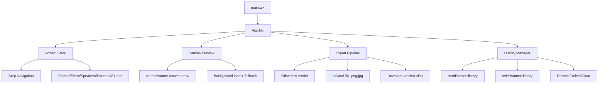

# Social Banner Generator - Technical Documentation

## 1. System Overview

Social Banner Generator is a client-side React + TypeScript application for producing social/event banners with live canvas rendering, image uploads, and high-quality export.

The application is fully browser-based:
- No backend API calls
- No server persistence
- State and history are local to the browser via localStorage

## 2. Technology Stack

- React 19
- TypeScript 5
- Vite 7
- ESLint 9 (type-aware configuration)

Runtime entrypoint:
- src/main.tsx mounts the app under React StrictMode.

## 3. Architecture



## 4. Domain Model

Core types are defined in src/App.tsx:

```ts
// Format and export options
type BannerFormat =
  | 'event_widescreen'
  | 'speaker_square'
  | 'speaker_banner'
  | 'social_promo'
  | 'luma_cover'

type ExportType = 'png' | 'jpg'
type ExportScale = 1 | 2
```

```ts
interface BannerState {
  format: BannerFormat
  colors: {
    primary: string
    secondary: string
    accent: string
    background: string
  }
  event: EventDetails
  speakers: Speaker[]
  partners: PartnerLogo[]
  export: {
    type: ExportType
    scale: ExportScale
  }
}
```

Data persistence model:
- Banner snapshots are stored as BannerHistoryItem[]
- Storage key: banner-history-v1
- Max history size: 20 items

## 5. Rendering Pipeline

Main renderer: renderBanner(canvas, state, format, backgroundFailed, scale)

Responsibilities:
- Configure target pixel dimensions according to selected format and export scale
- Load and draw format-specific background image
- Apply fallback gradient/solid background when assets fail
- Draw event typography blocks (city, event, date, location)
- Draw speaker avatars (image crop or initials fallback)
- Draw organization + partner panel where format supports it
- Draw social promo registration bar when enabled
- Draw partner footer logos on applicable formats

Utility helpers:
- loadImage: cached async image loader via imageCache Map
- wrapText / wrapTextWithBreaks: line breaking and truncation
- roundedRectPath: avatar clipping for rounded cards

## 6. Step Workflow and Validation Rules

Wizard steps are: Format, Event, Speakers, Partners, Export.

The visible step sequence changes by selected format:
- Cover formats (event_widescreen, luma_cover): only Format, Event, Export
- Social promo: Format, Event, Partners, Export
- Other social formats: all steps

Validation gate (canProceed):
- Social promo event step requires:
  - organization filled
  - organizer logo uploaded
  - registration URL filled when registration bar is enabled
- Speaker banner event step requires:
  - organization filled
  - organizer logo uploaded
- Speakers step requires:
  - maximum 4 speakers
  - all speaker names non-empty

## 7. File Upload and Safety

Upload handling is centralized in handleFile(file):
- Accepts image/* only
- Max file size: 8 MB
- Converts using FileReader to base64 data URL

The same validation path is used for:
- Speaker photos
- Organizer logo
- Partner logos

## 8. Export and History Flow

Export action (exportBanner):
1. Render full-resolution output on offscreen canvas
2. Convert to requested MIME:
   - image/png for PNG
   - image/jpeg for JPG
3. Generate 1x JPEG preview snapshot
4. Save preview + state to history (max 20)
5. Trigger browser download via temporary anchor

Filename pattern:
- banner-{format}-{scale}x.{type}

## 9. Local Storage Contract

History read/write functions:
- readBannerHistory() parses localStorage safely and filters invalid records
- writeBannerHistory(items) serializes back to localStorage

Defensive behavior:
- Invalid JSON or malformed records are ignored
- Type guard isBannerHistoryItem protects the UI from corrupted entries

## 10. Source Map (Documentation Parity)

- App bootstrap: src/main.tsx
- Main feature logic and rendering: src/App.tsx
- Component styling: src/App.css
- Global typography/base styles: src/index.css
- Background assets:
  - src/assets/luma-background.png
  - src/assets/speaker-background.png
  - src/assets/widescreen-background.png

## 11. Run and Build Instructions

Prerequisites:
- Node.js 20+
- npm 10+

Commands:

```bash
npm install
npm run dev
npm run lint
npm run build
npm run preview
```